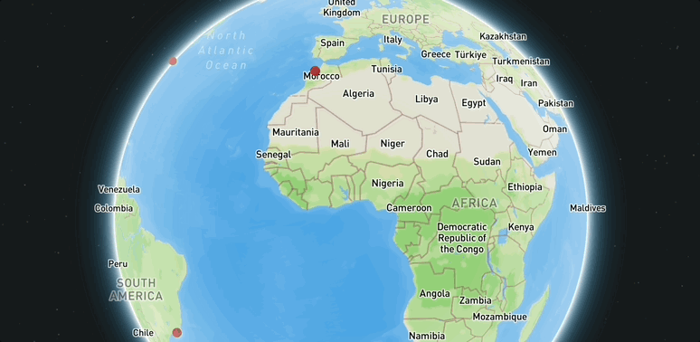

# places of interest

## What did I build?

Casablanca has cool landscapes like the beaches and the mountains.
NY square is very beutiful with many screens showing ads.
Rojo de janeiro has a cool asthetic vibe with a cool statue of jesus

Here's a demo:



## Why did I build this?

I built a map based on places I want to visit in the future. Even though I showed pictures of random places I want to visit the whole city not just that place.

## Tech stack

To build this app, I used the following tools:

1. [Google Maps](https://www.google.com/maps/), for generating the route lines, and exporting the geometries in `KML` format.
2. [Mapbox GL JS](https://docs.mapbox.com/mapbox-gl-js/guides) library, for styling and displaying maps and route lines, and adding camera behaviors (flyto animations).
4. [Visual Studio Code](https://code.visualstudio.com/download) free IDE, with [Live Server](https://marketplace.visualstudio.com/items?itemName=ritwickdey.LiveServer) and [Markdown All in One](https://marketplace.visualstudio.com/items?itemName=yzhang.markdown-all-in-one) extensions.
5. [GitHub pages](https://docs.github.com/en/pages/getting-started-with-github-pages/creating-a-github-pages-site), for publishing the app for free!

## Code Spotlight

```
{
    'type': 'Feature',
    'geometry': {
    'type': 'Point',
    'coordinates':  [-73.86154, 40.84687],
    },
    "properties": {
    'name': "Bronx NY",
    'description': "Da park",
    'image': 'img/park.png'
}
            },
```


the coordinates is where da park in Bronx NY is located. The Properties are name, description, and image. These show up on the pop up when you click the red circle next to new york.

